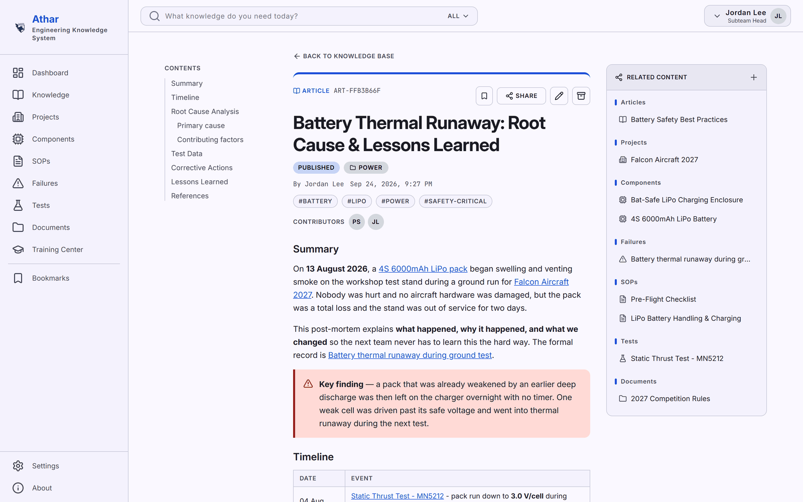

# Athar (أثر)

[](LICENSE)

Open-source, self-hosted **Knowledge Management System** for student AeroDesign teams — built and self-hosted by [Lycans AeroDesign](https://github.com/Lycans-AeroDesign) as its reference deployment.



> **Don't want to manage your own deployment?**  
> We are exploring a managed hosting option for teams that want to use Athar without maintaining their own infrastructure. Hosting would be provided by Lycans AeroDesign and may be offered through a subscription-based plan.
>
> If your team would be interested in a hosted Athar instance, [contact Lycans](https://www.lycansteam.com/contact) and let us know. Your interest will help us determine whether there is enough demand to launch a shared hosted service for teams.
>
> **Self-hosting will always remain available** — you can deploy your own independent instance, own your data, and manage your infrastructure yourself.

## Why

Student engineering teams accumulate a huge amount of knowledge — designs, failures, SOPs, flight history, decisions, lessons learned — that mostly lives in people's heads and disappears when they graduate. Athar exists so a new member can search the system and understand not just **what** the team does, but **why**.

> **athar** (أثر) `/ˈæ.θɑːr/` — _Arabic_: a trace, mark, or remnant left behind by something that has passed.

The name reflects that purpose — the system exists to preserve the trace a team's work and decisions leave behind, so that knowledge outlives the people who created it.

The full product specification (vision, feature areas, roles/permissions, roadmap) lives in [`docs/VISION.md`](docs/VISION.md). Three principles sit above everything else in it:

1. **Self-hosted-first, multi-tenant-capable** — a team can still clone/deploy their own fully independent instance and own their data outright, same as always; the backend is also genuinely multi-tenant now (an `Organization` model, every row scoped to it, self-service org creation alongside invite-based joining), so one deployment can serve several isolated organizations instead of exactly one. See [`docs/VISION.md` §2](docs/VISION.md#2-open-source-philosophy) for the fuller status note on this.
2. **Connected knowledge** — knowledge objects (articles, components, projects, failures, SOPs, tests, documents, decisions...) link to each other so context is discoverable, not siloed.
3. **Backend-enforced authorization** — the frontend is never a security boundary; every API request is authorized server-side, regardless of client.

## What's inside

Athar is a set of modules that build on each other — Knowledge is the foundation everything else links back to; Training turns that knowledge into something new members can actually learn from; the platform pieces (RBAC, search, backups, i18n) exist so the other two are trustworthy and usable day to day.

- **Knowledge** — articles, Q&A, categories/tags (including a dedicated "everything tagged X" browse page, not just a search-box filter), attachments, and cross-linking between any two items, with a full draft → review → publish workflow and revision history. Use it for anything written down for other people to read: write-ups, decisions, answers to recurring questions. This is the wiki that stops answers from living only in someone's head or a lost chat thread.
- **Engineering domain** (Projects, Components, Failures, SOPs, Tests/experiments, Documents) — structured records for the practical side of the work: what you're building, the parts in it, what broke and why, the procedures you follow, and the tests that proved something worked. Use it instead of scattered spreadsheets/PDFs so a project's failures, tests, and procedures stay linked to each other and to the components involved, not just filed away separately.
- **Training Center** — structured courses (Course → Module → Lesson), with text/video/document/external-link/exercise lesson types, enrollment, per-lesson completion tracking, and lessons that reference existing Knowledge content instead of duplicating it. Use it to turn "what the team knows" into "how a new member learns it" — an actual onboarding path instead of relying on ad hoc mentorship.
- **RBAC & multi-tenancy** — five seeded roles (Guest, Member, Mentor, Subteam Head, Organization Admin), enforced on every API request server-side, plus full per-organization data isolation. Use it to trust that permissions are real access control, not just hidden buttons in the UI — and to safely host more than one team's data in a single deployment if you need to.
- **Search** — Postgres full-text search (ranked) with a trigram-similarity fallback for typos/partial matches, across every content type. A knowledge base only pays off if people can actually find what's already in it.
- **Contribution scoring & activity feed** — a weighted leaderboard (monthly/yearly/lifetime standings) and a live feed of publish/answer/review events. Use it to give visible credit for maintaining the knowledge base, which is otherwise thankless, unrewarded work.
- **Backups** — an org-scoped in-app export/restore (Settings > Backups) for admins, plus a whole-instance CLI backup for self-hosters. See [Backups](#backups) below.
- **Internationalization** — the full UI in English and Arabic (with RTL layout), not just the content. Use it if your team doesn't operate primarily in English.

## Tech stack

| | |
|---|---|
| Backend | Django 6.1, Django REST Framework, `drf-spectacular` (OpenAPI), `uv`, Python 3.14 |
| Frontend | Next.js 16 (App Router), React 19, TypeScript, Tailwind CSS v4, a small custom Radix/cmdk-based UI kit (`frontend/components/ui/`) |
| Database | PostgreSQL 18 (via Docker), no SQLite fallback; search uses Postgres full-text search (`SearchVector`/`SearchRank`) with a trigram-similarity fallback for substring/typo matches, ranked by relevance |
| Background work | Redis + Celery (currently just the org-scoped backup export - see [Backups](#backups) below) |
| File storage | Local filesystem by default; set `AWS_STORAGE_BUCKET_NAME` to switch to any S3-compatible object storage instead (AWS S3, Cloudflare R2, Backblaze B2, self-hosted MinIO, ...) — see `backend/.env.example` |
| Deployment | Docker, Docker Compose, nginx reverse proxy in front of both the API and the frontend (rate limiting, security headers, health check, real HTTPS via Let's Encrypt/certbot in production - see `nginx/templates/` and [`DEPLOYMENT.md`](DEPLOYMENT.md)) |
| CI/CD | GitHub Actions (backend + frontend CI, PR checks, manual release/publish) |
| Testing | Backend: DRF `APITestCase` suite (`backend/*/tests.py`), run via `manage.py test` |

## Quickstart (Docker)

```bash
git clone https://github.com/Lycans-AeroDesign/Athar.git
cd Athar
python scripts/generate_env.py   # generates .env / backend/.env / frontend/.env with real secrets
docker compose up
```

- Frontend: http://localhost:3000
- Backend: http://localhost:8000
- Nginx (reverse proxy in front of both the backend and frontend - see `nginx/templates/`): http://localhost:80

For a production-shaped stack (gunicorn, standalone Next.js server, no bind mounts), pulling prebuilt images published by CI rather than building locally:

```bash
docker compose -f docker-compose.prod.yml pull
docker compose -f docker-compose.prod.yml up -d
```

`docker-compose.prod.yml` requires `SECRET_KEY`, `ALLOWED_HOSTS`, `CORS_ALLOWED_ORIGINS`, and `DOMAIN` to be set explicitly (no dev fallbacks). See [`DEPLOYMENT.md`](DEPLOYMENT.md) for the full checklist of what to change when deploying to a real server.

## Manual setup (without Docker)

**Backend** (from `backend/`):

Requires a running Postgres instance and `DATABASE_URL` set in `backend/.env` (copy from `backend/.env.example`) - there is no SQLite fallback.

```bash
uv sync                          # install dependencies into .venv
uv run manage.py migrate         # apply migrations
uv run manage.py runserver       # start dev server
```

**Frontend** (from `frontend/`):

```bash
npm install
npm run dev                      # start dev server (Turbopack) at http://localhost:3000
```

Copy `backend/.env.example` → `backend/.env` and `frontend/.env.example` → `frontend/.env` first (or run `python scripts/generate_env.py`).

## Project structure

```text
backend/            Django project (config/, manage.py, pyproject.toml)
frontend/            Next.js app (app/, package.json)
nginx/templates/              reverse proxy config templates (dev vs. prod+HTTPS), see DEPLOYMENT.md
scripts/init_letsencrypt.sh   one-time HTTPS bootstrap for a fresh deploy
DEPLOYMENT.md                 checklist for deploying to a real server
docker-compose.yml           dev stack (hot reload, Postgres, nginx)
docker-compose.prod.yml      prod-shaped stack (gunicorn, standalone Next.js, nginx)
scripts/generate_env.py      generates local .env files with real secrets
docs/VISION.md                full product specification
.github/                      CI, PR automation, issue/PR templates
```

## Internationalization

The frontend is fully translation-driven (`next-intl`) — no UI text is hardcoded, it all comes from `frontend/i18n/messages/<locale>.json`. Routes are locale-prefixed (`/en/...`, `/ar/...`).

**Supported languages:**

| Code | Language | Direction | Status |
|---|---|---|---|
| `en` | English | LTR | ✅ Fully supported (source language) |
| `ar` | العربية (Arabic) | RTL | ✅ Fully supported — `frontend/i18n/messages/ar.json` is kept in parallel with every key in `en.json`, genuinely translated (not a copy) |

A language only reaches "file exists" status once it's registered in `frontend/i18n/request.ts` (see below) *and* has a `messages/<code>.json` file — at that point it's selectable in Settings > General even before translation is complete, since next-intl has no per-key fallback. Update this table whenever a language's status changes.

**To add a new language:**

1. Add its code to `locales` in `frontend/i18n/request.ts`.
2. Give it a display name (`localeNames`) and text direction (`localeDirections`), also in `frontend/i18n/request.ts`.
3. Copy `frontend/i18n/messages/en.json` to `frontend/i18n/messages/<code>.json` and translate the values (keep the same keys).

The language picker in Settings > General is generated from `locales`/`localeNames`, so the new language appears there automatically once its message file exists.

## Backups

Two independent backup-and-restore paths, at two different scopes:

- **An organization's own data** (Settings > Backups, requires `organization.manage`) — exports that organization's own rows (users, knowledge/engineering content, files, audit log, ...) as a downloadable `.zip` (CSV per table, plus the actual uploaded files). Runs as a background Celery job so triggering it never ties up a request, however large the export - `docker compose up` already starts the `redis` and `celery-worker` services needed for this, no extra setup step. The same page can **restore** from any of that organization's own finished backups: a full wipe-and-replace of that organization's *content* (knowledge/engineering items, tags, categories, relations, restricted-access grants, bookmarks, attachments, and files) — original IDs are preserved, so cross-references between restored rows still line up. Deliberately scoped to content only: Users, Roles, and invitation codes are never touched, since a leaked backup must never be a credentials leak (`User.password` isn't in the export) and re-creating a User row from an archive raises correctness questions (merge? replace?) this app doesn't try to answer — an FK to a user who no longer exists in the organization is simply set to null and counted in the restore summary instead.
- **The whole instance** (every organization) — a real `pg_dump` of the entire database plus a tarball of the local media directory (skipped if file storage is S3-compatible - see the Tech stack table above), written to `backend/backup_archives/`. Deliberately CLI-only, not a web feature: `is_superuser` is break-glass/CLI-only everywhere else in this app, and Django admin itself isn't even registered outside `DEBUG` (see `backend/config/urls.py`), so there's no web-exposed "download/restore every organization's data" surface to get wrong. Restoring is a full wipe-and-replace of the *entire* database via `pg_restore --clean --if-exists`, gated behind an explicit `--yes` flag.

```bash
docker compose exec backend python manage.py create_full_backup
docker compose exec backend python manage.py restore_full_backup backup_archives/athar-db-<timestamp>.dump --media-archive-path backup_archives/athar-media-<timestamp>.tar.gz --yes
```

## Contributing

See [`CONTRIBUTING.md`](CONTRIBUTING.md) for commit conventions, backend/frontend conventions, and the PR checklist.

## Security

See [`SECURITY.md`](SECURITY.md) to report a vulnerability.

## License

[Apache License 2.0](LICENSE) © 2026 Lycans AeroDesign Team.
